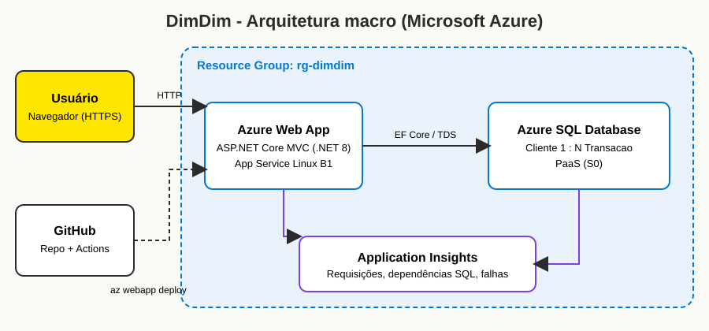

# DimDim - Web App + Azure SQL na nuvem

Aplicação web em **ASP.NET Core MVC (.NET 8)** para a DimDim: cadastro de **Clientes** e **Transações** (relação 1:N), com CRUD completo nas duas tabelas. Roda em **Azure Web App**, persiste em **Azure SQL Database** e é monitorada com **Application Insights**.

## Descrição da solução
- Front end MVC com telas de listagem, criação, edição e exclusão para `Cliente` e `Transacao`.
- Entity Framework Core grava no Azure SQL (PaaS, não containerizado).
- Excluir um cliente exclui suas transações (`ON DELETE CASCADE`).
- Application Insights coleta requisições, dependências SQL, falhas e desempenho.
- Segredos (senha do SQL, connection string do Insights) ficam só em App Settings do Azure, nunca no código.

## Arquitetura


## Estrutura
```
src/DimDim/            código-fonte da aplicação
scripts/ddl.sql        DDL das tabelas
scripts/*.sh           scripts do Azure CLI
.github/workflows/     deploy com GitHub Actions
docs/arquitetura.svg   desenho da arquitetura
```

## How to: implantar do zero
Pré-requisitos: conta Azure, [Azure CLI](https://learn.microsoft.com/cli/azure/install-azure-cli), [.NET 8 SDK](https://dotnet.microsoft.com/download), `zip`. Use o **Azure Cloud Shell (Bash)** se preferir: ele já traz `az`, `dotnet` e `sqlcmd`.

```bash
git clone https://github.com/FelipeConteFerreira/CP5-DevOps.git && cd CP5-DevOps
az login

# 1. Cria Resource Group, Application Insights, Azure SQL, Web App e configurações
bash scripts/01-criar-recursos.sh

# 2. Cria as tabelas (ou cole scripts/ddl.sql no Query editor do portal)
bash scripts/02-executar-ddl.sh

# 3. Deploy automatizado (dotnet publish + az webapp deploy)
bash scripts/03-deploy.sh
```
O script 1 pede a senha do SQL e mostra o **sufixo** gerado. Nos passos seguintes, na mesma sessão, ele é reaproveitado. Em outra sessão, rode antes `export SUFIXO=<seu_sufixo>`.

Abra `https://dimdim-app-<sufixo>.azurewebsites.net`.

> Se o `az sql server create` recusar a região, use `export LOC=eastus2` antes do passo 1.
> As tabelas também são criadas automaticamente na primeira execução do app (`EnsureCreated`) caso o passo 2 seja pulado.

### Alternativa: deploy com GitHub Actions
1. `bash scripts/04-github-actions-credenciais.sh`
2. No GitHub, em *Settings > Secrets and variables > Actions*, crie `AZURE_CREDENTIALS` (JSON impresso) e `AZURE_WEBAPP_NAME`.
3. Faça push na branch `main` (ou rode o workflow manualmente em *Actions*). O workflow `deploy.yml` compila e publica com `az webapp deploy`.

## Como testar (e o que mostrar no vídeo)
1. **Clientes > Novo cliente**: crie, edite e exclua. Após cada operação, rode no *Query editor* do portal: `SELECT * FROM Cliente;`
2. **Transações > Nova transação**: crie, edite e exclua. Após cada operação: `SELECT * FROM Transacao;`
3. Exclua um cliente com transações e mostre o `CASCADE` nas duas tabelas.
4. No recurso **Application Insights**: *Live metrics*, *Transaction search*, *Performance* (dependências SQL) e *Failures*.

## Limpeza
`bash scripts/99-limpar.sh` remove o Resource Group inteiro e evita cobranças.

## Execução local (opcional)
```bash
export ConnectionStrings__DefaultConnection="<connection string>"
dotnet run --project src/DimDim
```
